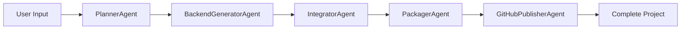

# 🚀 CODE AGENT - AI-Powered Backend Generator

Transform natural language prompts, PRD documents, and impact analysis reports into production-ready backend applications with seamless frontend integration.

## Overview

CODE AGENT is an intelligent Python web application that automates backend code generation using AI. It converts:
- **Natural language descriptions** into detailed technical specifications
- **Impact Analysis Reports** (mandatory) containing API endpoints into structured backend APIs
- **PRD documents** into comprehensive project specifications
- **Frontend repositories** into fully integrated full-stack projects

Built with **Streamlit**, **LangGraph**, and modern AI models (Ollama local, OpenRouter, Groq).

## ✨ Key Features

### 🤖 Multi-Agent Workflow (LangGraph)
- **PlannerAgent**: Analyzes requirements, extracts API endpoints from impact analysis, creates detailed specs
- **BackendGeneratorAgent**: Generates production-ready backend code (FastAPI/Django) with routes, models, auth, DB schemas
- **IntegratorAgent**: Integrates frontend repos, sets up CORS, environment files, connection management
- **PackagerAgent**: Creates downloadable ZIP archives with perfect project structure
- **GitHubPublisherAgent**: Automatically publishes projects to GitHub (optional)

### 📊 Impact Analysis Integration (Mandatory)
- **Extracts API endpoints** automatically from PDF/JSON/TXT impact analysis reports
- **Identifies input fields** and request/response schemas
- **Overrides LLM-generated endpoints** with extracted authoritative data
- **Displays extracted endpoints** with input fields in real-time logs
- Ensures backend generation matches exact API specifications

### 🧠 LLM Support with Smart Fallback
- **Primary**: Ollama (local) with Qwen2.5 Coder 7B - private, fast, no API keys needed
- **Fallback**: OpenRouter / Groq / OpenAI / Anthropic - automatic failover
- Robust error handling and retry mechanisms
- Support for multiple model providers

### 🔧 Backend Stack Support
- **FastAPI + SQLAlchemy**: Modern async Python API framework
- **Django**: Full-featured Python web framework
- Auto-generated database migrations
- CORS middleware integration
- Environment configuration management

### 🎯 Frontend Integration
- **Clone frontend repositories** from GitHub
- **Automatic API connection setup** between frontend and backend
- **CORS configuration** for seamless development
- **Environment variable management** for both frontend and backend
- Support for React, Next.js, Vue, and other frontend frameworks

### 📦 Complete Project Structure
- **Mandatory .bat files** for Windows users (setup.bat, run.bat, migrate.bat)
- Environment configuration (.env.example)
- Requirements/dependencies files
- README with setup instructions
- Git repository initialization
- Proper .gitignore files

## 📋 Prerequisites

- **Python 3.11 or higher**
- **Ollama** (recommended for local AI) - [Download](https://ollama.ai/download)
  - Install Qwen2.5 Coder 7B: `ollama pull qwen2.5-coder:7b`
- **Git** (for cloning frontend repositories)
- **pip** or **poetry** for package management

## 🚀 Installation

### 1. Clone the Repository
```bash
git clone <repository-url>
cd grok
```

### 2. Install Dependencies
```bash
pip install -r requirements.txt
```

### 3. Set Up Ollama (Recommended - Local AI)

#### Install Ollama
- Visit https://ollama.ai/download
- Download and install for your OS
- Start Ollama: `ollama serve` (usually runs automatically)

#### Install the Model
```bash
ollama pull qwen2.5-coder:7b
```

#### Verify Installation
```bash
# Check if Ollama is running
curl http://localhost:11434/api/tags

# List installed models
ollama list

# Test the model
ollama run qwen2.5-coder:7b "Write a hello world function in Python"
```

### 4. (Optional) Set Up Fallback API Keys
Create a `.env` file in the project root:
```env
# Ollama Configuration (Primary)
OLLAMA_MODEL=qwen2.5-coder:7b
OLLAMA_BASE_URL=http://localhost:11434
USE_OLLAMA=true

# Fallback Providers (Optional)
OPENROUTER_API_KEY=your_openrouter_key
GROQ_API_KEY=your_groq_key
OPENAI_API_KEY=your_openai_key
ANTHROPIC_API_KEY=your_anthropic_key

# GitHub (for publishing projects)
GITHUB_ACCESS_TOKEN=your_github_token
```

**Note**: The app will use Ollama by default. Fallback providers are only used if Ollama is unavailable.

## 💻 Usage

### 1. Start the Application
```bash
streamlit run app.py
```

Or use the provided batch file (Windows):
```batch
run_app.bat
```

### 2. Open in Browser
Navigate to `http://localhost:8501`

### 3. Fill in the Form

#### Required Fields:
- **GitHub Frontend URL** *: Repository URL containing frontend code
- **Backend Stack** *: Choose FastAPI + SQLAlchemy or Django
- **Impact Analysis Report** *: Upload PDF/JSON/TXT containing API endpoints with input fields
- **Project Name**: Auto-filled from repo URL, can be customized

#### Optional Fields:
- **PRD Document**: Upload PDF/JSON/TXT with project requirements
- **GitHub Token**: For private repositories
- **Publish to GitHub**: Automatically create and push to GitHub repository

### 4. Generate Project
Click **"🚀 Generate Full Project"** and watch the real-time progress:
1. 📋 **Planning**: Extracting endpoints from impact analysis, creating specification
2. 🔧 **Backend Generation**: Generating backend code with exact API endpoints
3. 🔗 **Integration**: Integrating frontend repo, setting up connections
4. 📦 **Packaging**: Creating ZIP archive
5. 🐙 **Publishing** (optional): Pushing to GitHub

### 5. Download or Use Project
- Download the generated ZIP file
- Or access the GitHub repository (if published)

## 📁 Generated Project Structure

```
your-project/
├── backend/
│   ├── app/
│   │   ├── main.py              # FastAPI/Django main application
│   │   ├── models.py            # Database models
│   │   ├── routers.py           # API routes
│   │   └── schemas.py           # Pydantic schemas
│   ├── requirements.txt         # Python dependencies
│   ├── .env.example            # Environment variables template
│   ├── setup.bat               # Windows setup script (mandatory)
│   ├── run.bat                 # Windows run script (mandatory)
│   ├── migrate.bat             # Database migration script (mandatory)
│   └── README.md               # Setup instructions
├── frontend/                    # Cloned frontend repository
│   └── ...                     # Frontend code
├── .env                        # Environment configuration
├── .gitignore                  # Git ignore rules
└── README.md                   # Project documentation
```

## 🔄 How It Works

### Workflow Overview



### Detailed Process

1. **Impact Analysis Processing**
   - Extracts API endpoints, methods, paths, and input fields
   - Parses request/response schemas
   - Displays extracted data in logs
   - Overrides LLM-generated endpoints with extracted data

2. **Project Planning**
   - Analyzes PRD and impact analysis
   - Creates comprehensive technical specification
   - Defines database schema
   - Identifies authentication requirements

3. **Backend Code Generation**
   - Generates complete backend with exact API endpoints
   - Creates Pydantic models matching input fields
   - Implements database models and migrations
   - Adds authentication middleware
   - Creates mandatory .bat files for Windows

4. **Frontend Integration**
   - Clones frontend repository
   - Sets up API service connections
   - Configures CORS
   - Creates environment files
   - Links frontend and backend

5. **Packaging & Publishing**
   - Creates structured ZIP archive
   - Initializes Git repository
   - Optionally publishes to GitHub

## 🛠️ Project Structure

```
grok/
├── app.py                      # Main Streamlit application
├── requirements.txt            # Python dependencies
├── README.md                   # This file
├── OLLAMA_SETUP.md            # Detailed Ollama setup guide
├── run_app.bat                # Windows launcher script
│
├── agents/                     # AI Agent Implementations
│   ├── planner.py             # PlannerAgent - Creates project specs
│   ├── backend_generator.py   # BackendGeneratorAgent - Generates backend code
│   ├── integrator.py          # IntegratorAgent - Integrates frontend/backend
│   ├── packager.py            # PackagerAgent - Creates ZIP archives
│   └── github_publisher.py    # GitHubPublisherAgent - Publishes to GitHub
│
├── workflow/                   # LangGraph Workflow
│   └── orchestrator.py        # ProjectOrchestrator - Coordinates all agents
│
├── utils/                      # Utility Modules
│   ├── logger.py              # StreamlitLogger - Real-time logging
│   ├── llm_manager.py         # LLMFactory & LLMWithFallback - LLM management
│   ├── content_parsers.py     # ImpactAnalyzer & RobustJSONParser
│   ├── code_fixer.py          # CodeFixer - Fixes syntax errors
│   ├── package_validator.py   # Validates and fixes package names
│   ├── connection_manager.py  # Frontend-backend connection setup
│   ├── file_browser.py        # File tree visualization
│   └── github_client.py       # GitHub API client
│
└── config/                     # Configuration
    ├── app_config.py          # Application configuration
    └── base.py                # Base configuration classes
```

## 🎯 Key Components

### Impact Analysis Parser
- Extracts API endpoints from various formats (PDF, JSON, TXT)
- Parses markdown tables, JSON structures, and plain text
- Identifies HTTP methods, paths, request bodies, and response schemas
- Ensures backend matches exact specifications

### LLM Manager with Fallback
- **Primary**: Ollama (local, private, free)
- **Fallback Chain**: OpenRouter → Groq → OpenAI → Anthropic
- Automatic failover on errors
- Configurable via environment variables

### Code Quality Assurance
- Robust JSON parsing with error recovery
- Syntax error detection and fixing
- Package name validation
- Code formatting and validation
- Complete file validation

### Frontend-Backend Integration
- Automatic CORS configuration
- API endpoint mapping
- Environment variable management
- Connection service generation

## 🔧 Configuration

### Environment Variables

| Variable | Description | Default |
|----------|-------------|---------|
| `OLLAMA_MODEL` | Ollama model name | `qwen2.5-coder:7b` |
| `OLLAMA_BASE_URL` | Ollama server URL | `http://localhost:11434` |
| `USE_OLLAMA` | Enable/disable Ollama | `true` |
| `OPENROUTER_API_KEY` | OpenRouter API key | - |
| `GROQ_API_KEY` | Groq API key | - |
| `OPENAI_API_KEY` | OpenAI API key | - |
| `ANTHROPIC_API_KEY` | Anthropic API key | - |
| `GITHUB_ACCESS_TOKEN` | GitHub token for publishing | - |
| `MAX_TOKENS` | Max tokens per request | `1500` |
| `LLM_TIMEOUT` | Request timeout (seconds) | `120` |

### LLM Provider Priority

1. **Ollama** (if `USE_OLLAMA=true` and available)
2. **OpenRouter** (if API key provided)
3. **Groq** (if API key provided)
4. **OpenAI** (if API key provided)
5. **Anthropic** (if API key provided)

## 📝 Impact Analysis Report Format

The Impact Analysis Report should contain API endpoints in any of these formats:

### JSON Format
```json
{
  "endpoints": [
    {
      "method": "POST",
      "path": "/api/users",
      "description": "Create a new user",
      "request_body": {
        "email": "string",
        "password": "string",
        "name": "string"
      }
    }
  ]
}
```

### Markdown Format
```markdown
## API Endpoints

### POST /api/users
Create a new user

**Input:**
- email: string
- password: string
- name: string
```

### Plain Text Format
```
POST /api/users - Create user
Input: email (string), password (string), name (string)
```

## 🚨 Troubleshooting

### Ollama Not Working
- **Check if Ollama is running**: `curl http://localhost:11434/api/tags`
- **Start Ollama**: `ollama serve`
- **Verify model installed**: `ollama list`
- **Pull model**: `ollama pull qwen2.5-coder:7b`
- App will automatically fallback to OpenRouter/Groq if Ollama fails

### Impact Analysis Not Extracting Endpoints
- Ensure file is PDF, JSON, or TXT format
- Check that endpoints are clearly defined in the document
- Review logs for extraction details
- Endpoints should include HTTP method, path, and input fields

### Backend Generation Fails
- Check LLM provider is available (Ollama running or API keys set)
- Verify Impact Analysis contains valid endpoints
- Review error logs for specific issues
- System includes fallback mechanisms

### Frontend Integration Issues
- Verify GitHub repository URL is correct
- Check GitHub token for private repos
- Ensure frontend repository is accessible
- Review CORS configuration in generated backend

## 🎓 Examples

### Example 1: E-Commerce Backend
```
Frontend Repo: https://github.com/user/ecommerce-frontend
Backend Stack: FastAPI + SQLAlchemy
Impact Analysis: Contains endpoints for products, cart, orders, payments
Result: Complete backend with all API endpoints matching impact analysis
```

### Example 2: Blog Platform Backend
```
Frontend Repo: https://github.com/user/blog-frontend
Backend Stack: Django
Impact Analysis: Contains endpoints for posts, comments, users, auth
Result: Django backend with REST API matching specifications
```

## 🤝 Contributing

Contributions are welcome! Please feel free to submit a Pull Request.

## 📄 License

MIT License

## 💬 Support

For issues, questions, or feature requests:
- Open an issue on GitHub
- Check the `OLLAMA_SETUP.md` for Ollama-specific help
- Review logs in the Streamlit app for detailed error messages

## 🙏 Acknowledgments

- **LangChain** - LLM orchestration framework
- **LangGraph** - Multi-agent workflow engine
- **Streamlit** - Interactive web application framework
- **Ollama** - Local LLM serving platform
- **OpenRouter** - Unified LLM API gateway

---

**Built with using Streamlit, LangGraph, and modern AI models.**

